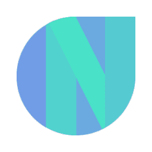

# Newton School Coding Club, PCCOE👨🏻‍💻

*This is actually a **Mobile Application** to educate students about **Development** and Problem-Solving using **Contests, Content, Workshops**, and many more interactive activities. The **motive** of this Mobile Application is to get notified about our **contests, job opportunities, team hiring, and reading informational** content.*

## Features🙌🏻

- Educate **student** about Development and Problem-solving skills.
- Empowering student to become **Rockstar developers** to get **sky-high packages** at some of the leading **companies**.
- Get **notified** about the contests, job opportunities and many more...
- Hackathon + Coding Contest + Seminars + Participate to **win** prices & Goodies.

## Contributing🧑‍🤝‍🧑

Contributions are **always welcome!**

## Tech Stack⚙️

- Flutter
- Firebase
- Codemagic

## Demo💥

Run live [NSCC](https://nsccpccoe.web.app/) application.

## Thanks to all the contributors ❤️
